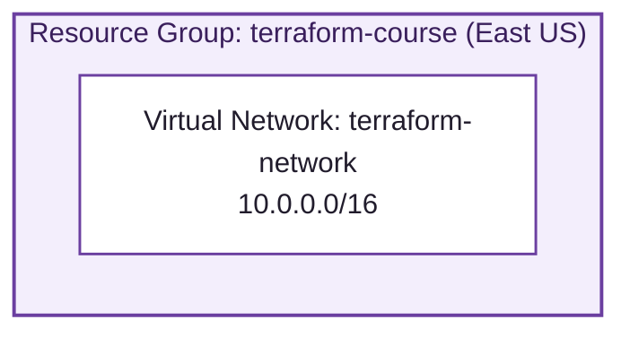
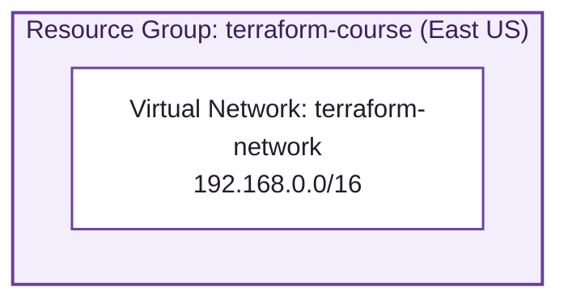
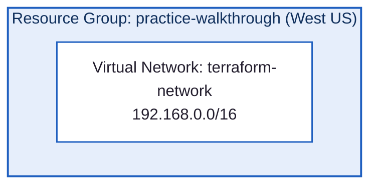

# terraform-course

Hands-on labs for the HashiCorp Certified: Terraform Associate course ([btkrausen/terraform-associate-labs](https://github.com/btkrausen/terraform-associate-labs)), provisioning Azure infrastructure with Terraform.

## Tech Stack

| Layer | Tool |
|---|---|
| Infrastructure provisioning | Terraform, provider `hashicorp/azurerm ~> 5.2` |
| Cloud platform | Microsoft Azure (Resource Groups, Virtual Networks) |
| State management | Local Terraform state (`terraform.tfstate`) — no remote backend |
| Version control | Git / GitHub |

## Repository Structure

```
terraform-course/
├── lab_02/     # Resource group + vnet, first pass
├── lab_03/     # Resource group + vnet, revised address space
└── lab_003/    # Resource group + vnet, built from scratch (no walkthrough)
```

Each lab folder is a self-contained Terraform configuration (`main.tf`, `providers.tf`, `variables.tf`, `outputs.tf`) — `cd` into one and run `terraform init` before `plan`/`apply`.

---

## [lab_02](lab_02) — First Resource Group + VNet



| Resource | Name | Detail |
|---|---|---|
| `azurerm_resource_group` | `terraform-course` | East US |
| `azurerm_virtual_network` | `terraform-network` | `10.0.0.0/16` |

## [lab_03](lab_03) — Address Space + Tag Update



| Resource | Name | Detail |
|---|---|---|
| `azurerm_resource_group` | `terraform-course` | East US |
| `azurerm_virtual_network` | `terraform-network` | `192.168.0.0/16` (updated in-place from lab_02's range) |

## [lab_003](lab_003) — Built From Scratch

Same resource shapes as lab_02/lab_03, written independently without following the walkthrough — first lab done from memory.



| Resource | Name | Detail |
|---|---|---|
| `azurerm_resource_group` | `practice-walkthrough` | West US |
| `azurerm_virtual_network` | `terraform-network` | `192.168.0.0/16` |
