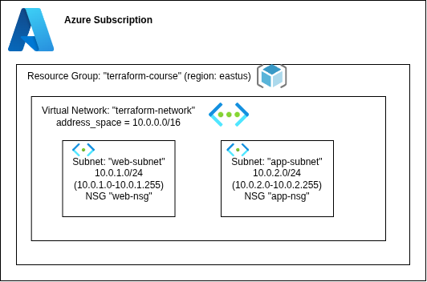

# LAB-04-AZ — Subnets & Network Security Groups

Builds on the resource group + virtual network from earlier labs by carving the
VNet into two subnets and wrapping each in a Network Security Group.

## Network Architecture



| Resource | Value | Notes |
|---|---|---|
| Resource Group | `terraform-course` (eastus) | Groups and lifecycle-manages everything below |
| Virtual Network | `terraform-network` — `10.0.0.0/16` | Owns `10.0.0.0` – `10.0.255.255` |
| Subnet `web-subnet` | `10.0.1.0/24` | NSG `web-nsg` — inbound TCP 80 / 443 from anywhere |
| Subnet `app-subnet` | `10.0.2.0/24` | NSG `app-nsg` — inbound TCP 8080 from `10.0.1.0/24` only |

Every subnet prefix must fall inside the VNet `address_space`; Azure enforces
this server-side at `apply` (not at `plan`).

## Usage

```bash
terraform init
terraform plan
terraform apply
```
